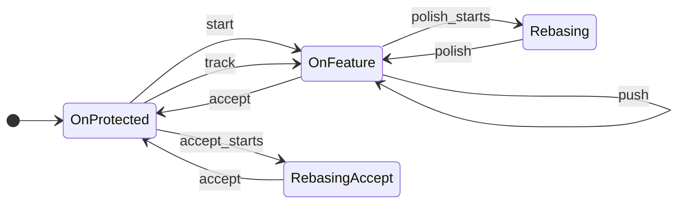
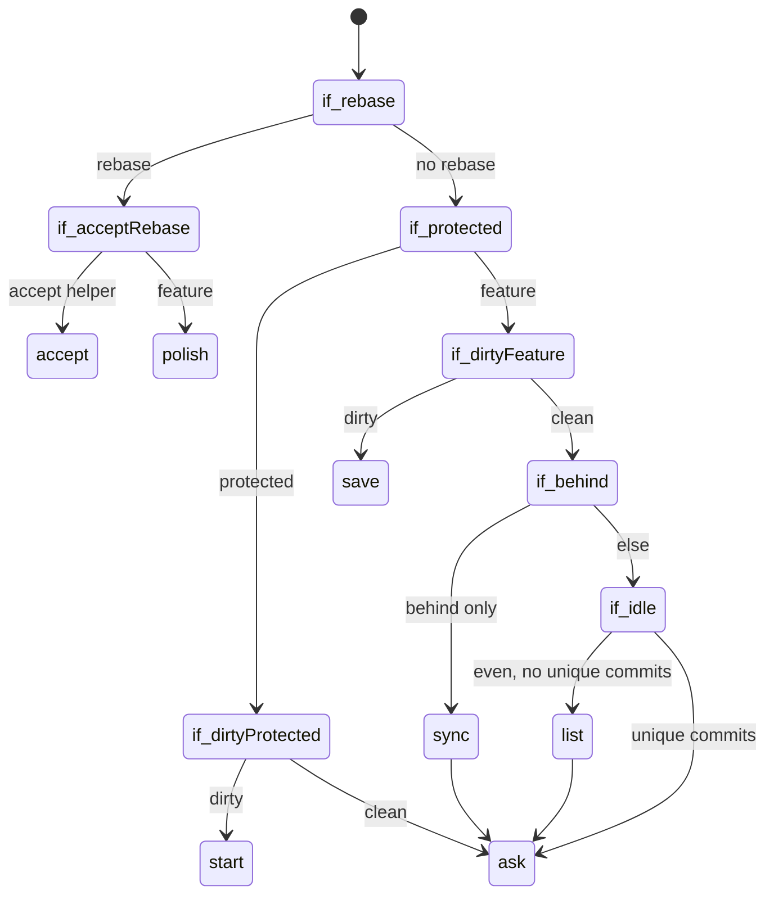

# Work Actions

## Context

[Object without an action](002-interactive-vs-non-interactive-execution.md) for
`git elegant work`. The work object is day-to-day branch workflow: `start`,
`save`, `amend`, `list`, `polish`, `sync`, `push`, `track`, `accept`.

When the action is omitted, pick one from git state, or ask with a
[closed list](003-interactive-questions.md#closed-list). Non-interactive mode
always requires an action.

## Lifecycle



`OnProtected` is the default development branch or any other protected branch.
`OnFeature` is any other local branch. `list` does not change state.

## Detection

First matching rule wins. “Dirty” means uncommitted changes. “Unique commits”
means commits on HEAD that are not on the source branch from `start`.



1. Rebase in progress — `polish` (continues the rebase). If the branch being
   rebased is `__eg` (accept’s helper checkout), `accept` instead. Git records
   that name in rebase metadata (`head-name`); it does not record which command
   started the rebase.
2. Dirty and on a protected branch — `start` (no commits on protected branches).
3. Dirty and on a feature branch — `save`.
4. Clean and behind upstream only — `sync`, then ask.
5. Clean, even with upstream, and no unique commits — `list`, then ask.
6. Otherwise ask.

Print each check in order, then the decision. Stop after the first matching rule.

```text
==>> Detection action...
rebase in progress? no
on protected branch 'main'? yes
uncommitted changes? yes
selected: git elegant work start
```

```text
==>> Detection action...
rebase in progress? no
on protected branch 'feat'? no
uncommitted changes? no
behind upstream only? no (ahead 2, behind 0)
unique commits vs source? yes
selected: ask
What next? [polish/push/list/quit] (press enter to 'quit'):
```

The header uses the same green `==>>` / blue title styling as command lines. Check and
decision lines use the terminal default color.

After auto `list` or `sync`, print `selected: ask` once (do not re-print the checks).

## Ask

Closed list of actions that still make sense, plus `quit`. Default is always
`quit`.

```text
What next? [start/save/push/list/quit] (press enter to 'quit'):
```

Typical sets:

- On protected, clean — `[start/track/accept/list/quit]`
- On feature, unique commits, no upstream or ahead of upstream —
  `[polish/push/list/quit]`
- On feature, diverged from upstream — `[sync/push/list/quit]`
- Detached HEAD — `[start/track/quit]`

`amend` is never auto-detected; it is always an explicit action.
