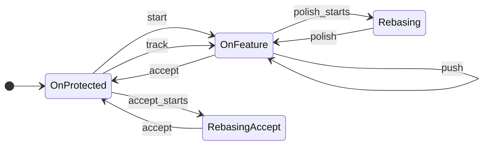
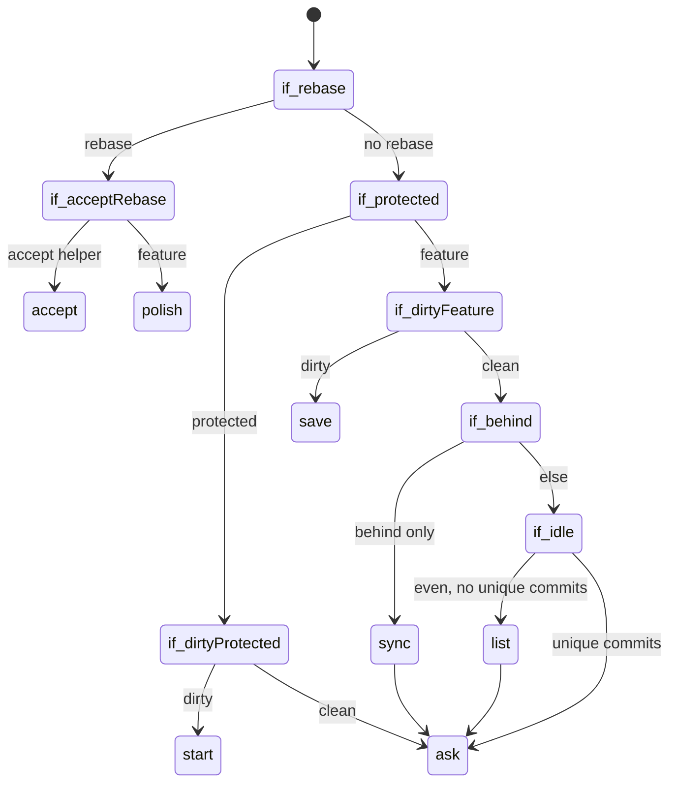

# Work Actions

## Context

[Object without an action](002-interactive-vs-non-interactive-execution.md) for
`git elegant work`. The work object is day-to-day branch workflow: `start`,
`save`, `amend`, `list`, `polish`, `sync`, `push`, `track`, `accept`.

When the action is omitted, pick one from git state, or
[ask](004-object-without-action.md#ask). Non-interactive mode always requires
an action.

## Lifecycle

`OnProtected` is the default development branch or any other protected branch.
`OnFeature` is any other local branch. `list` does not change state.

## Detection

First matching rule wins. “Dirty” means uncommitted changes. “Unique commits”
means commits on HEAD that are not on the source branch from `start`.

1. Rebase in progress — `polish` (continues the rebase). If the branch being
   rebased is `__eg` (accept’s helper checkout), `accept` instead. Git records
   that name in rebase metadata (`head-name`); it does not record which command
   started the rebase.
2. Dirty and on a protected branch — `start` (no commits on protected branches).
3. Dirty and on a feature branch — `save`.
4. Clean and behind upstream only — `sync`, then ask.
5. Clean, even with upstream, and no unique commits — `list`, then ask.
6. Otherwise ask.

Print and ask: [Detection](004-object-without-action.md#detection),
[Ask](004-object-without-action.md#ask).

## Ask

Typical sets:

- On protected, clean — `start` / `track` / `accept` / `list` / `quit`
- On feature, unique commits, no upstream or ahead of upstream —
  `polish` / `push` / `accept` / `list` / `quit`
- On feature, diverged from upstream — `sync` / `push` / `accept` / `list` / `quit`
- On feature, idle — `start` / `accept` / `list` / `track` / `quit`
- Detached HEAD — `start` / `track` / `quit`

On a feature branch, ask `accept` uses HEAD (does not pick a branch). On a
protected branch, `accept` still asks which branch to take.

`amend` is never auto-detected; it is always an explicit action.
