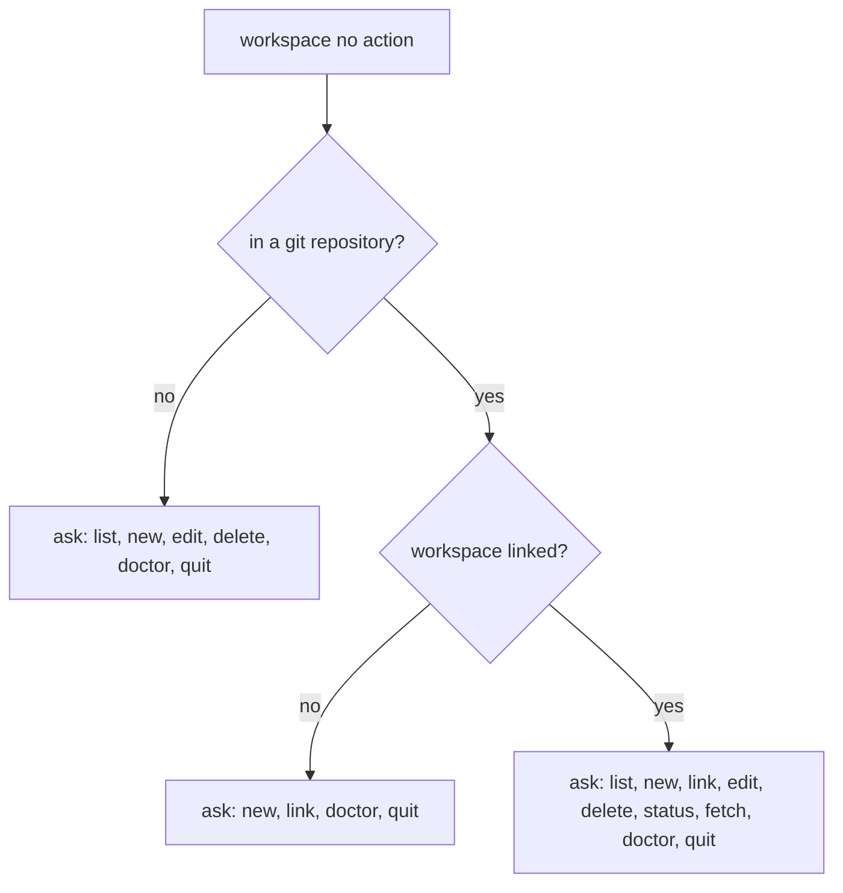

# Workspace Object

Usually, there is more than one git repository in a company. A workspace helps
manage them so they feel like a single entity — an isolated git workspace.

## Shared Identity

A workspace maintains a single git identity among its repositories:

- account identity
  - name → `git config user.name`
  - email → `git config user.email`
- signature configuration (optional)
  - signing key
  - gpg program
- editor configuration

## Namespace-based Detection

A git repository URL usually has a `<domain>/<owner>/<repo>` structure (for
example `github.com/acme/app` or `gitlab.com/group/subgroup/app`). The
**namespace** is the normalized `<domain>/<owner...>` prefix derived from any
git origin format (HTTPS, SSH, SCP-like, `git://`). The same namespace may be
attached to many workspaces.

When a repository is linked (`repo configure`, `repo clone`, `repo init`,
`workspace link`, or `workspace new` applying to the current repository) and
its origin yields a namespace not yet recorded on the chosen workspace, the user
is asked to confirm remembering it.

When `repo clone` omits the workspace argument:

- a unique namespace match suggests that workspace
- several matches narrow the picker to those workspaces
- no match offers the full workspace picker including `[Create new]`
- in non-interactive mode, a unique match is used; otherwise no workspace is
  assigned

## Supported Actions

A workspace object supports the following actions:

- list — shows available workspaces or details for a specific one
- new — creates a workspace and optionally applies it to the current repository
  on confirmation
- link — links the current repository to an existing workspace (force-applies identity
  and may capture the origin namespace)
- edit — edits a workspace and propagates changes to linked repositories
- delete — explains what will happen, asks for confirmation, then deletes the
  workspace and clears `workspace_id` on linked repository registry entries
  without changing those repositories' git config or files
- status — shows the linked workspace for the current repository
- fetch — runs `git fetch --all --tags --prune` in every repository linked to
  the current or specified workspace (prunes stale remote-tracking branches);
  exits non-zero if any repository fails
- doctor — finds shared memory and repository link problems of one workspace,
  then suggests a repair for each of them

### doctor

The workspace to examine is the given name, the workspace linked to the current
repository, or a picked one. Non-interactive mode requires the name.

Every problem is printed together with the repair it proposes. Yes/no repairs
apply only after confirmation. Branching repairs ask once: missing path
(path / remove / ignore); not a git work tree (remove / ignore); orphan
workspace reference (clear / remove — required so shared memory can be saved).
A declined or ignored repair leaves the problem in place. Non-interactive mode
changes nothing and fails when at least one problem is found, so automation
notices an unhealthy workspace. Shared memory is written once, after the last
answer, and only when something changed.

Shared memory problems and their repairs:

- `name`, `user_name`, or `user_email` is empty — asks for the value
- another workspace has the same `name` — asks for a new name
- `linked_repos` holds an unknown repository — drops that entry
- `linked_repos` holds a repository owned by another workspace — drops that
  entry
- a repository points to this workspace but is missing from `linked_repos` —
  adds it
- a repository points to a workspace that no longer exists — clear
  `workspace_id` or remove the entry (cannot ignore; Validate would block save)
- `namespaces` holds blank, untrimmed, or duplicated values — normalizes them

Repository problems and their repairs:

- `current_path` no longer exists or is inaccessible — set a new git work tree
  path (stamps `elegant-git.repo-id` when unset), remove the entry, or ignore;
  the previous path moves to `path_history`. A path already owned by another
  registry entry, or already stamped with a different `elegant-git.repo-id`, is
  refused
- `current_path` is not a git work tree — remove the entry, or ignore
- `elegant-git.repo-id` is unset or differs from the registry — stamps the
  registry id
- per-repo memory `workspace_id` differs from the registry — rewrites it

Repairs that need more than a yes or no (a new path, a replacement name, an
identity field) are reported without a question in non-interactive mode.

## Action Detection

The interactive action detection always asks (never auto-runs an action):

When no workspaces exist yet, options that need one are omitted: outside git offers
only `new` and `quit`; unlinked offers `new` and `quit` (no `link` or `doctor`);
linked with a corrupt zero-count registry still offers `new`, `status`, `fetch`, and
`quit`.
