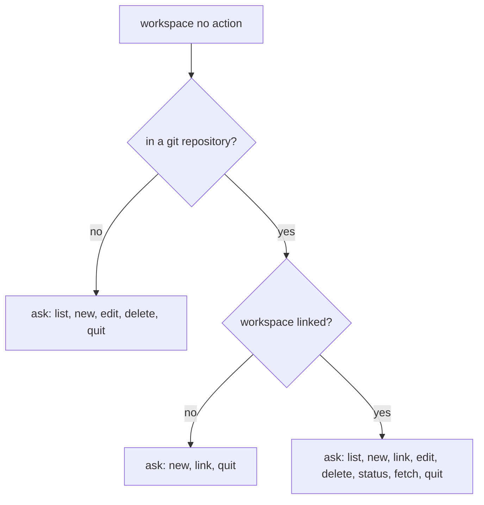

# Workspace Object

Usually, there is more than one git repository in a company. A workspace helps
manage them so they feel like a single entity — an isolated git workspace.

## Shared Identity

A workspace maintains a single git identity among its repositories:

- account identity
  - name → `git config user.name`
  - email → `git config user.email`
- signature configuration (optional)
  - signing key
  - gpg program
- editor configuration

## Namespace-based Detection

A git repository URL usually has a `<domain>/<owner>/<repo>` structure (for
example `github.com/acme/app` or `gitlab.com/group/subgroup/app`). The
**namespace** is the normalized `<domain>/<owner...>` prefix derived from any
git origin format (HTTPS, SSH, SCP-like, `git://`). The same namespace may be
attached to many workspaces.

When a repository is linked (`repo configure`, `repo clone`, `repo init`,
`workspace link`, or `workspace new` applying to the current repository) and
its origin yields a namespace not yet recorded on the chosen workspace, the user
is asked to confirm remembering it.

When `repo clone` omits the workspace argument:

- a unique namespace match suggests that workspace
- several matches narrow the picker to those workspaces
- no match offers the full workspace picker including `[Create new]`
- in non-interactive mode, a unique match is used; otherwise no workspace is
  assigned

## Supported Actions

A workspace object supports the following actions:

- list — shows available workspaces or details for a specific one
- new — creates a workspace and optionally applies it to the current repository
  on confirmation
- link — links the current repository to an existing workspace (force-applies identity
  and may capture the origin namespace)
- edit — edits a workspace and propagates changes to linked repositories
- delete — explains what will happen, asks for confirmation, then deletes the
  workspace and clears `workspace_id` on linked repository registry entries
  without changing those repositories' git config or files
- status — shows the linked workspace for the current repository
- fetch — runs `git fetch --all --tags --prune` in every repository linked to
  the current or specified workspace (prunes stale remote-tracking branches);
  exits non-zero if any repository fails

## Action Detection

The interactive action detection always asks (never auto-runs an action):

When no workspaces exist yet, options that need one are omitted: outside git offers
only `new` and `quit`; unlinked offers `new` and `quit` (no `link`); linked with a
corrupt zero-count registry still offers `new`, `status`, `fetch`, and `quit`.
