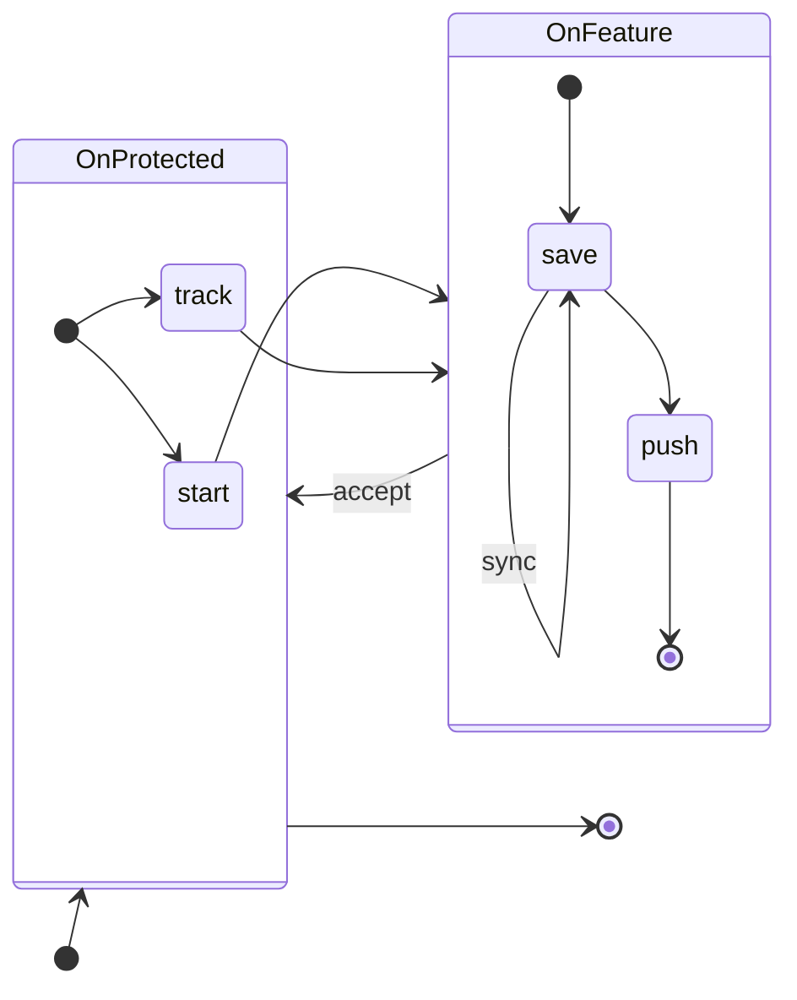

# Getting started

Commands follow `eg <object> <action>`. A bare `eg` or `eg <object>` lists the available
actions or runs context-based interactive flow.

## Git configuration

Once Elegant Git is [installed](02-00-installation.md), the first interactive `eg` command
configures your Git installation if it has not been configured yet. `eg git configure` does
the same at any time. The [configuration](reference/configuration.md) page lists the logic.
.

## Repository onboarding

For an existing repository, run `eg repo configure`. That links the repository to a
[workspace](guides/workspaces.md), writes user identity into `.git/config`, and records the
default and protected branches in per-repo memory.

Use `eg repo init` to create a repository, or `eg repo clone` to clone one. Both run the
same onboarding as `repo configure`.

## Making changes

Regular work with Git means creating branches, committing, pushing changes, and merging
to upstream or from upstream. `eg work` does it for you by providing contextual
suggestions.

If you run `eg work` with no action, Elegant Git looks at the repository and either runs the
obvious next step or asks you to choose. The usual path from new work to the default
development branch is `start` → `save` → `push` → `accept`.

The state-transition diagram shows an example workflow from starting new work to merging it.
`OnProtected` is the default development branch or any other protected branch. `OnFeature`
is any other local branch.

## Next steps

- [Commands](reference/commands.md) — every object and action
- [Guides](guides.md) — how the tool behaves while you use it
- [Configuration](reference/configuration.md) — what `eg git configure` and `eg repo configure` apply
- [Memory](reference/memory.md) — where Elegant Git keeps its own state
