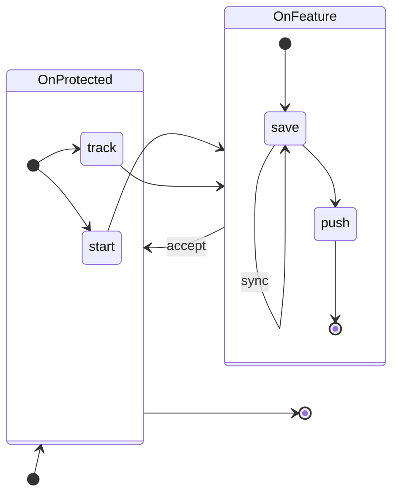

# Getting started

Commands follow `eg <object> <action>`. Outside a work tree, in a repository with no commits, or when prompts are off, a bare
`eg` prints help. Inside a repository it runs the work action detected from the current state, the
same way `eg work` does. When that detection has nothing to run, or it runs an action and still
needs a choice, it opens a picker of the commands that fit and runs the one you choose. A bare
`eg <object>` lists that object's actions or runs its context-based flow.

## Git configuration

Once Elegant Git is [installed](02-00-installation.md), the first interactive `eg` command
configures Git if it has not been configured yet. `eg self configure` does
the same at any time. The [configuration](reference/configuration.md) page lists the logic.
.

## Repository onboarding

For an existing repository, run `eg repo configure`. That links the repository to a
[workspace](06-00-workspace.md), writes user identity into `.git/config`, and records the
default and protected branches in per-repo memory.

Use `eg repo init` to create a repository, or `eg repo clone` to clone one. Both run the
same onboarding as `repo configure`.

## Making changes

Regular work with Git means creating branches, committing, pushing changes, and merging
to upstream or from upstream. `eg work` does it for you by providing contextual
suggestions.

If you run `eg work` with no action, Elegant Git looks at the repository and either runs the
obvious next step or asks you to choose. The usual path from new work to the default
development branch is `start` → `save` → `push` → `accept`.

The state-transition diagram shows an example workflow from starting new work to merging it.
`OnProtected` is the default development branch or any other protected branch. `OnFeature`
is any other local branch.

```mermaid
stateDiagram-v2
  direction LR
  [*] --> OnProtected
  start --> OnFeature
  track --> OnFeature
  OnFeature --> OnProtected: accept
  OnProtected --> [*]

  state OnProtected {
    [*] --> start
    [*] --> track
  }

  state OnFeature {
    [*] --> save
    save --> save: polish
    save --> save: sync
    save --> push
    push --> [*]
  }
```

## Next steps

- [CLI anatomy](04-cli-anatomy.md) — the five parts of every command line
- ["work" guide](08-00-work.md) — how `eg work` picks the next action, and every action
- ["workspace" guide](06-00-workspace.md) — one identity shared across many repositories
- [Reference](reference.md) — configuration, memory, interaction, and the rest
