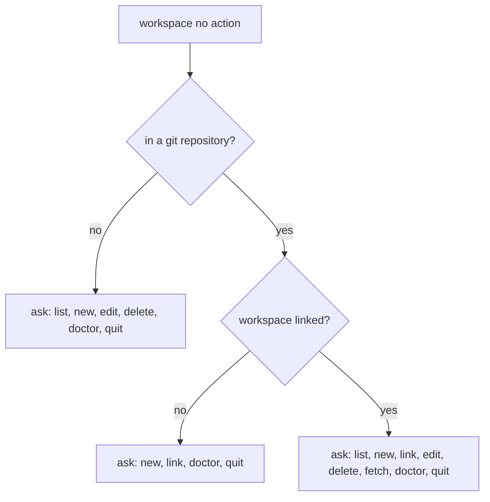

# "workspace" guide

Usually, there is more than one Git repository in a company. A **workspace** helps you manage them
so they feel like a single entity — an isolated Git workspace. You describe an identity once, link
your repositories to it, and Elegant Git keeps `.git/config` in each of them in sync with that
description.

## Actions

- [`list`](06-01-workspace-list.md) — Lists workspaces or shows the current or named one.
- [`new`](06-02-workspace-new.md) — Creates a workspace.
- [`link`](06-03-workspace-link.md) — Links the current repository to a workspace.
- [`edit`](06-04-workspace-edit.md) — Edits a workspace and optionally applies it to linked repos.
- [`delete`](06-05-workspace-delete.md) — Deletes a workspace and unlinks its repositories.
- [`fetch`](06-06-workspace-fetch.md) — Fetches remotes for repositories linked to a workspace.
- [`doctor`](06-07-workspace-doctor.md) — Diagnoses and repairs a workspace.

## The shared identity

A workspace maintains a single Git identity among its repositories:

- account identity
  - name — written to `git config user.name`
  - email — written to `git config user.email`
- signature configuration (optional)
  - signing key
  - `gpg` program
- editor configuration

Only the account identity is required. The rest is applied when you have it, and
[`eg repo configure`](07-01-repo-configure.md) asks before writing an optional field into a
repository. Values that already match the workspace are skipped without a prompt. The full field
list, with the names they get on disk, is on the [memory](reference/memory.md) page.

## How a namespace is remembered

A Git repository URL usually has a `<domain>/<owner>/<repo>` structure — for example
`github.com/acme/app` or `gitlab.com/group/subgroup/app`. The **namespace** is the normalized
`<domain>/<owner…>` prefix, and Elegant Git derives it from any origin format you use: HTTPS, SSH,
SCP-like, or `git://`. The same namespace may be attached to many workspaces, so it is a hint
rather than a key.

Whenever you link a repository — `eg repo configure`, `eg repo clone`,
`eg repo init`, `eg workspace link`, or `eg workspace new` applying to
the current repository — and its origin yields a namespace the chosen workspace has not recorded
yet, you are asked to confirm remembering it. In non-interactive mode it is recorded silently.

That memory pays off when `repo clone` runs without a workspace argument:

- a unique namespace match suggests that workspace
- several matches narrow the picker down to those workspaces
- no match offers the full workspace picker, including `[Create new]`
- in non-interactive mode a unique match is used, and otherwise no workspace is assigned

## What bare `workspace` does

`eg workspace` with no action always asks; it never runs an action for you. It still
prints what it saw first, so you know which options you are looking at. In non-interactive mode
an action is required.

If you have no workspaces yet, the options that need one drop out. Outside a repository you are
offered only `new` and `quit`; an unlinked repository offers `new` and `quit` as well, without
`link` or `doctor`. A linked repository whose registry reports zero workspaces still offers `new`,
`list`, `fetch`, and `quit`.
