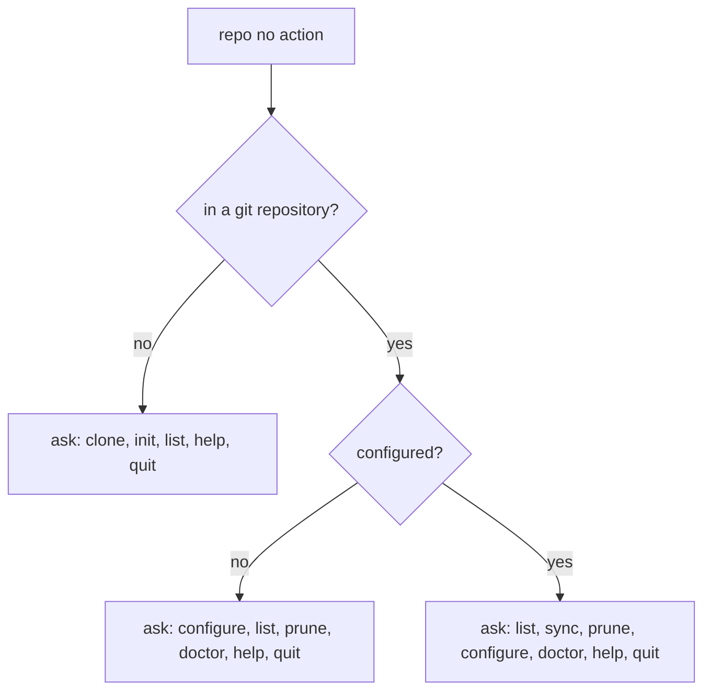

# "repo" guide

The `repo` object is how you onboard a Git repository to Elegant Git, keep its identity in sync
with a [workspace](06-00-workspace.md), and tidy the local branches you no longer need.

## Actions

- [`configure`](07-01-repo-configure.md) — Configures the current local Git repository.
- [`clone`](07-02-repo-clone.md) — Clones a remote repository and configures it.
- [`init`](07-03-repo-init.md) — Initializes a new repository and configures it.
- [`list`](07-04-repo-list.md) — Lists repositories or shows the current or named one.
- [`sync`](07-05-repo-sync.md) — Re-applies workspace settings to repositories.
- [`prune`](07-06-repo-prune.md) — Removes useless local branches.
- [`doctor`](07-07-repo-doctor.md) — Diagnoses and repairs the current repository.

## What bare `repo` does

`eg repo` with no action always asks; it never runs an action for you. It still prints what it saw
first, so you know which options you are looking at. In non-interactive mode it prints the action
list instead — the same text as `eg repo --help`.

`help` prints the action list and asks again. `quit` leaves without another action.
