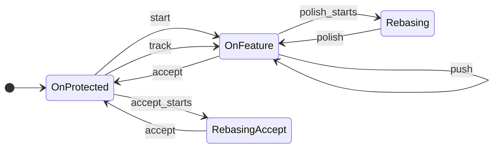
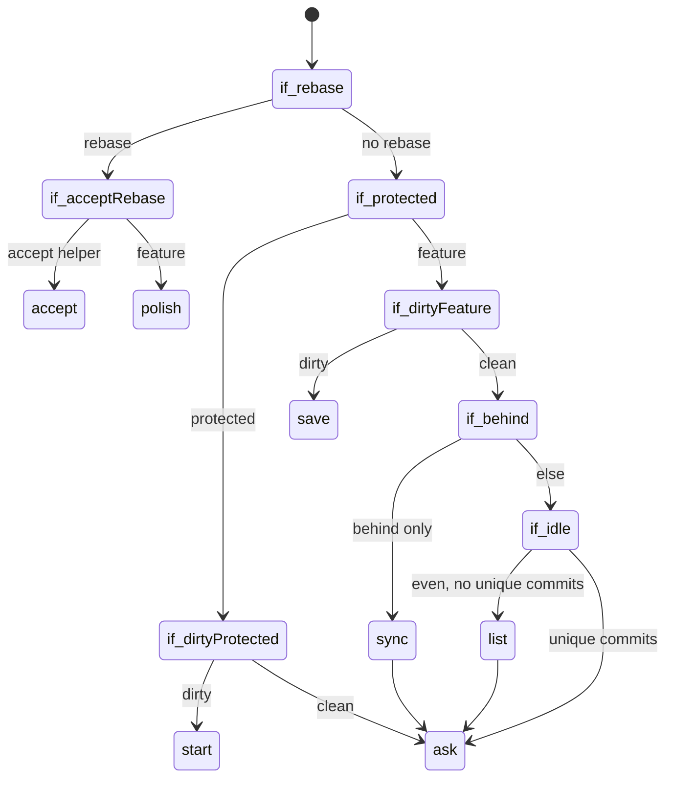

# "work" guide

The `work` object covers your day-to-day branch routine. It has nine actions — `start`, `save`,
`amend`, `list`, `polish`, `sync`, `push`, `track`, and `accept` — and between them they carry a
change from a fresh branch to the default development branch.

You don't have to remember which one comes next. If you run `eg work` with no action,
Elegant Git looks at the repository, tells you what it saw, and either runs the obvious action or
asks you to choose. In non-interactive mode there is nothing to ask, so an action is always
required — see [interaction](reference/interaction.md) for what "interactive" means here.

## Actions

- [`start`](08-01-work-start.md) — Creates a new branch.
- [`save`](08-02-work-save.md) — Commits current modifications.
- [`amend`](08-03-work-amend.md) — Amends the last commit.
- [`list`](08-04-work-list.md) — Prints HEAD state.
- [`polish`](08-05-work-polish.md) — Rebases HEAD interactively.
- [`sync`](08-06-work-sync.md) — Actualizes the branch with upstream commits.
- [`push`](08-07-work-push.md) — Publishes HEAD to a remote repository.
- [`track`](08-08-work-track.md) — Checks out a remote-tracking branch.
- [`accept`](08-09-work-accept.md) — Adds modifications to the default development branch.

## The branch lifecycle

`OnProtected` is the default development branch or any other protected branch. `OnFeature` is any
other local branch. `list` only reports, so it never changes the state.

## How the action is detected

Two terms are worth unpacking before the checks. "Dirty" means there are uncommitted changes.
"Unique commits" means there are commits on `HEAD` that the source branch — the branch you passed
to `start`, or the default development branch — does not have.

Elegant Git walks these checks in order and stops at the first one that fits.

1. A rebase is in progress — `polish`, which continues that rebase. If the branch being rebased is
   `__eg`, the helper checkout `accept` creates, then `accept` runs instead. Git records only the
   branch name in the rebase metadata (`head-name`); it does not record which command started the
   rebase, so that name is the whole signal.
2. Dirty and on a protected branch — `start`, because Elegant Git does **not** commit to a
   protected branch.
3. Dirty and on a feature branch — `save`.
4. Clean and behind upstream only — `sync`, and then you are asked what to do next.
5. Clean, even with upstream (or without an upstream at all), and no unique commits — `list`, and
   then you are asked what to do next.
6. Anything else — you are asked straight away.

If `HEAD` is detached, Elegant Git never picks an action for you — dirty or not, you are asked.

Both the checks and the decision are printed before anything happens, so you can see why an action
was chosen. The exact shape of that output is described in
[interaction](reference/interaction.md#how-detection-is-printed).

## What you are asked

When Elegant Git asks, it offers the actions that still make sense in the current state, plus
`quit`. Each option comes with its purpose, and `quit` is the default — see
[the picker](reference/interaction.md#picker). The typical sets are:

- on a protected branch, clean — `start` / `track` / `accept` / `list` / `quit`
- on a feature branch with unique commits and either no upstream or ahead of it —
  `polish` / `push` / `accept` / `list` / `quit`
- on a feature branch diverged from upstream — `sync` / `push` / `accept` / `list` / `quit`
- on an idle feature branch — `start` / `accept` / `list` / `track` / `quit`
- on a detached `HEAD` — `start` / `track` / `quit`

`track` checks out a remote-tracking branch, so it is offered only when the repository has at least
one remote. Without remotes the detached-`HEAD` set shrinks to `start` / `quit`, and `track` drops
out of the idle set.

Two more details are easy to miss. On a feature branch, picking `accept` accepts the branch you are
already on — it does not ask you to choose one. On a protected branch it still asks which branch to
take. And `amend` is never detected and never offered; rewriting your last commit is always
something you ask for explicitly with `eg work amend`.
