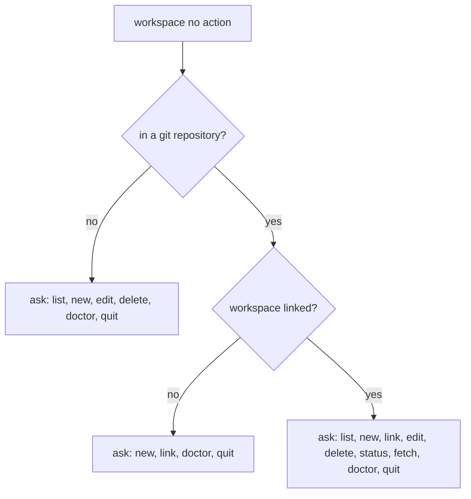

# Workspaces

Usually, there is more than one Git repository in a company. A **workspace** helps you manage them
so they feel like a single entity — an isolated Git workspace. You describe an identity once, link
your repositories to it, and Elegant Git keeps `.git/config` in each of them in sync with that
description.

## The shared identity

A workspace maintains a single Git identity among its repositories:

- account identity
  - name — written to `git config user.name`
  - email — written to `git config user.email`
- signature configuration (optional)
  - signing key
  - `gpg` program
- editor configuration

Only the account identity is required. The rest is applied when you have it, and
`git elegant repo configure` asks before writing an optional field into a repository. Values that
already match the workspace are skipped without a prompt. The full field list, with the names they
get on disk, is on the [memory](../reference/memory.md) page.

## How a namespace is remembered

A Git repository URL usually has a `<domain>/<owner>/<repo>` structure — for example
`github.com/acme/app` or `gitlab.com/group/subgroup/app`. The **namespace** is the normalized
`<domain>/<owner…>` prefix, and Elegant Git derives it from any origin format you use: HTTPS, SSH,
SCP-like, or `git://`. The same namespace may be attached to many workspaces, so it is a hint
rather than a key.

Whenever you link a repository — `git elegant repo configure`, `git elegant repo clone`,
`git elegant repo init`, `git elegant workspace link`, or `git elegant workspace new` applying to
the current repository — and its origin yields a namespace the chosen workspace has not recorded
yet, you are asked to confirm remembering it. In non-interactive mode it is recorded silently.

That memory pays off when `repo clone` runs without a workspace argument:

- a unique namespace match suggests that workspace
- several matches narrow the picker down to those workspaces
- no match offers the full workspace picker, including `[Create new]`
- in non-interactive mode a unique match is used, and otherwise no workspace is assigned

## The actions

`git elegant workspace` is how you drive this. The actions are:

- `list` — shows available workspaces, or the details of one
- `new` — creates a workspace and, on confirmation, applies it to the current repository
- `link` — links the current repository to an existing workspace, writes the identity even if the
  repository already has values, and may capture the origin namespace
- `edit` — edits a workspace and propagates the changes to linked repositories
- `delete` — explains what will happen, asks for confirmation, then deletes the workspace and
  clears `workspace_id` on the linked registry entries. Those repositories keep their Git config
  and files untouched
- `status` — shows the workspace linked to the current repository
- `fetch` — runs `git fetch --all --tags --prune` in every repository linked to the current or
  given workspace. Exits non-zero if any repository fails
- `doctor` — finds shared memory and repository link problems of one workspace, then suggests a
  repair for each of them

`workspace edit` is transactional. It collects your field edits and your per-repository apply
decisions, shows one summary, confirms once, and only then saves shared memory and touches the
selected repositories.

## Running doctor

You can name the workspace to examine; if you don't, Elegant Git uses the one linked to the current
repository, or asks you to pick one. In non-interactive mode the name is required.

Every problem is printed together with the repair it proposes. A yes/no repair applies only after
you confirm. When there is more than a yes or no, you are asked once — a missing path offers
path / remove / ignore; a path that is not a Git work tree offers remove / ignore; an orphan
workspace reference offers clear / remove, and there is no ignore because shared memory could not
be saved otherwise. If you decline or ignore a repair, the problem stays. Shared memory is written
once, after your last answer, and only when something actually changed.

In non-interactive mode `doctor` changes nothing and fails when at least one problem is found, so
your automation notices an unhealthy workspace. Repairs that need more than a yes or no — a new
path, a replacement name, an identity field — are reported without a question.

Shared memory problems and their repairs:

- `name`, `user_name`, or `user_email` is empty — asks for the value
- another workspace has the same `name` — asks for a new name
- `linked_repos` holds an unknown repository — drops that entry
- `linked_repos` holds a repository owned by another workspace — drops that entry
- a repository points to this workspace but is missing from `linked_repos` — adds it
- a repository points to a workspace that no longer exists — clears `workspace_id` or removes the
  entry
- `namespaces` holds blank, untrimmed, or duplicated values — normalizes them

Repository problems and their repairs:

- `current_path` no longer exists or is inaccessible — set a new work tree path, remove the entry,
  or ignore it. Setting a path stamps `elegant-git.repo-id` when it is unset and moves the previous
  path into `path_history`. A path already owned by another registry entry, or already stamped with
  a different `elegant-git.repo-id`, is refused
- `current_path` is not a Git work tree — remove the entry, or ignore it
- `elegant-git.repo-id` is unset or differs from the registry — stamps the registry id
- per-repo memory `workspace_id` differs from the registry — rewrites it

## What bare `workspace` does

`git elegant workspace` with no action always asks; it never runs an action for you. It still
prints what it saw first, so you know which options you are looking at:

If you have no workspaces yet, the options that need one drop out. Outside a repository you are
offered only `new` and `quit`; an unlinked repository offers `new` and `quit` as well, without
`link` or `doctor`. A linked repository whose registry reports zero workspaces still offers `new`,
`status`, `fetch`, and `quit`.
